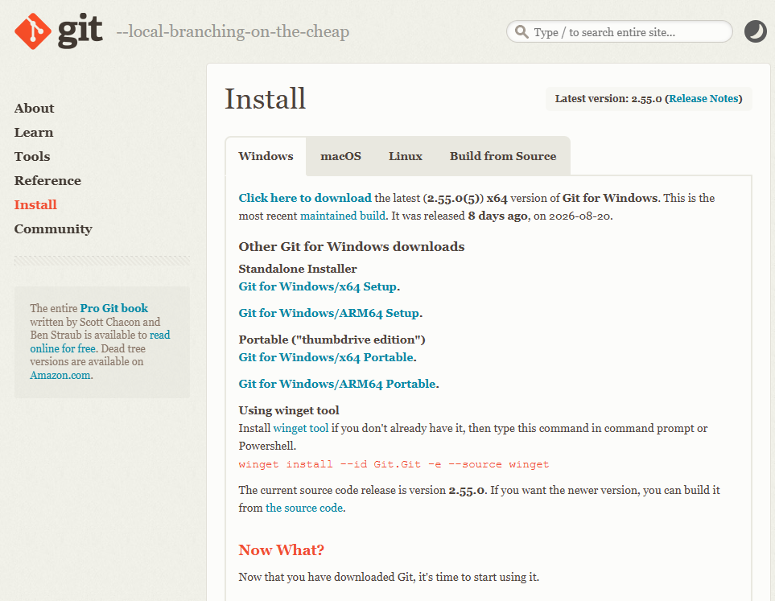

# Plantilla del Curso de Programación Web 

2026-2

---

## Descripción del Proyecto

Esta plantilla implementa una aplicación web full-stack utilizando React.js + Vite para el frontend y Node.js + Express para el backend. El proyecto está organizado para separar la interfaz, lógica de negocio, acceso a datos y configuración, permitiendo desarrollar tanto el sitio web como un panel administrativo.

La aplicación utiliza Supabase como base de datos y dispone de migraciones SQL para gestionar su estructura y datos iniciales. Además, incluye configuración para Vercel, vistas EJS para páginas del servidor y una API organizada mediante controladores, servicios y repositorios.

| Carpeta | Descripción |
|---|---|
| `admin/` | Lógica del panel administrativo: APIs, controladores, modelos, repositorios y servicios. |
| `api/` | Punto de entrada de la API del servidor. |
| `configs/` | Configuración general, base de datos, middlewares y funciones auxiliares. |
| `db/` | Esquema y migraciones SQL de la base de datos Supabase. |
| `docs/` | Documentación técnica, incluyendo el diagrama de la base de datos. |
| `public/` | Archivos públicos y recursos estáticos. |
| `src/` | Aplicación React: páginas, componentes, estilos, helpers y entradas de la aplicación. |
| `views/` | Plantillas EJS para las páginas renderizadas por Express. |
| `website/` | Lógica del sitio web: APIs, controladores, modelos, repositorios, rutas y servicios. |
| `server.js` | Archivo principal para iniciar y configurar el servidor Express. |

## Comandos Git

Descargar Git [Enlace](https://git-scm.com/install/windows)

Crear proyecto git

    >git init

Pasos para guardar el proyecto en git

    >git status
    >git add . o "Nombre del archivo"
    >git restore . o "Nombre del archivo"
    >git commit -m "Titulo"
    >git log --oneline

Logearse

    >git config --global user.name "tu nombre"
    >git config --global user.email "tu correo"

Crear rama
    
    >git checkout -b "nombre de la dimension 2XD"

Ver rama

    >git branch

Regresar a rama

    >git checkout master

Ir a una etapa del git

    >git reset --hard "id del commit"

Subir a tu github personal

    >git remote set-url origin git@github:usuario/repositorio.git

Instalar dependencias:

    npm install

npm install -g vercel
vercel login
vercel --prod